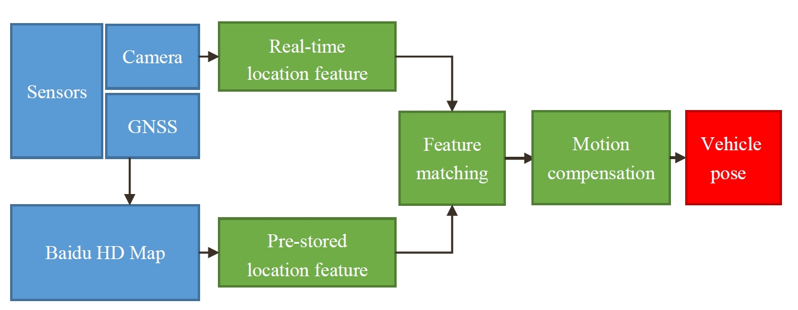

### Download

You can download the elo (aka Ego Localization) module here [elo-1.5.zip](https://github.com/ApolloAuto/apollo/releases/download/v1.5.0/elo-1.5.zip)

### 1. Introduction

Baidu ego localization system is an accurate ego localization solution for self-driving. By combining sensor information, Global navigation satellite systems (GNSS), and Baidu HD Map into one system, Baidu ego localization system is able to offer a localization solution with high accuracy.

GNSS positioning observes range measurements from orbiting GNSS satellites, while GNSS in general has some restrictions that it may not be available for high accuracy requirements of self-driving. Baidu ego localization system combines sensor information with HD Map and GNSS solution to provide high-accuracy localization solution. System extracts features from sensors and Baidu HD Map for feature matching. After feature matching, system is able to locate current vehicle in HD Map. Motion compensation is proposed to compensate current localization solution. 



The main components of Baidu ego localization system is introduced as follow:
* Sensors: inlcude vision sensors (in-vehicle cameras, industrial camera CCDs and other image collecting sensors) and position sensors (include GPS, GLONASS, Beidou and other GNSS).
* HD Map: HD Map provides road information within specific area.
* Real-time location feature: Baidu ego localization system applies deep neural network architecture `ENet` (see: [ENet: A Deep Neural Network Architecture for Real-Time Semantic Segmentation](https://arxiv.org/abs/1606.02147)) to extract lane lines and mark features by sensor for feature matching.
* Pre-stored location feature: obtains lane lines and mark features provided by HD Map.
* Feature matching: Baidu ego localization system locates current ego vehicle in HD Map by feature matching.
* Motion compensation: compensates current frame and adjusts the matching result via historical information.

### 2. Requirements: software

#### a. External dependencies

* Requirements for `cmake 2.8.7` or higher (see: [cmake installation instructions](https://cmake.org/Wiki/CMake))

* Requirements for `OpenCV 3.X` (see: [OpenCV installation instructions](http://docs.opencv.org/master/df/d65/tutorial_table_of_content_introduction.html))

* Recommended requirements for `Protobuf` (see: [github](https://github.com/google/protobuf)) 

* Recommended requirements for `CUDA` (see: [CUDA installation instructions](http://docs.nvidia.com/cuda/index.html#installation-guides)) 

* Recommended requirements for `Eigen 3` (see: [Eigen installation instructions](http://eigen.tuxfamily.org/dox/)) 

* Recommended requirements for `jsoncpp` (see: [github](https://github.com/open-source-parsers/jsoncpp))

#### b. Internal dependencies

* Requirements for `modified Caffe`  (`lib/libcaffe.so`)

* Requirements for `HD Map database` (`config/hadmap/hadmap.db`)

### 3. Requirements: hardware

Deployed on NVIDIA Drive PX2 (PDK 4.1.4.0).

### 4. Data format

* Input file:

  Note that optimum solution from SPAN-CPT (ground_truth_longitude` and `ground_truth_latitude`) are provided to make comparison with solution from Baidu ego localization system.

  ```
  image_name longitude latitude ground_truth_longitude ground_truth_latitude
  ```
* Config file:

  ```
  # effective image rectangle: top-left corner point, width and height of resulting cropped image in BGR format, pixel
  top-left_corner_point_x top-left_corner_point_y width height

  # width and height of ENet input image, pixel
  segmented_image_width segmented_image_height
 
  # camera parameters: principal point, focal length and rotation angle of camera related to vehicle coordinate system, pixel and radian
  principal_point_x principal_point_y focal_length_x focal_length_y pitch yaw roll

  # center point of image, pixel
  center_point_x center_point_y 

  # ENet parameters file
  enet_para_path

  # ENet structure file
  enet_structure_path

  # camera parameters: translation of camera related to vehicle coordinate system, pixel
  translation_x translation_y

  # database of HD Map 
  database_path
  ```
  Sample config parameters

  ```
  510 808 1410 1068
  448 224
  948.617 628.628 1918.64 1924.48 -3.9 0.6 0
  960 604
  ../data/model/model_binary.caffemodel
  ../data/model/net.prototxt
  0 150
  ../data/hadmap/hadmap.xml
  ```
* Output format:

  ```
  image_name
  [+] Begin Localization
  [-] End Localization, misc time: runtime ####
  [INFO] GROUNDTRUTH (ground_truth_longitude, ground_truth_latitude)  LOCALIZATION (localization_longitude, localization_latitude)
  ```
  Sample output:
  ```
  20170628_000039131.jpg
  [+] Begin Localization
  [-] End Localization, misc time: 91.95475700ms ####
  [INFO] GROUNDTRUTH (133.02665542, 25.40116628)   LOCALIZATION (133.02666082, 25.40117062)
  ```

### 5. Installation

* Install and build dependencies in `2. Recommended requirements: software`, then do the following steps.

* a. System software dependencies can be installed with: 

   ```Shell
   sudo apt-get install cmake libhdf5-dev liblmdb-dev libleveldb-dev libatlas-dev libatlas-base-dev libgflags-dev libgoogle-glog-dev libopencv-dev libmatio-dev libcurl4-openssl-dev
   ```

* b. Find the `elo` in `modules`:

   We'll call the directory `elo` into `P_ROOT`

* c. Compile and run localization:
   
   ```Shell
   cd $P_ROOT
   mkdir build
   cd build
   cmake ..
   make
   ./localization_test config_file input_file image_path
   ```

### 6. Demo

* Hardware description:

  image: SEKONIX SF3323, 30 Hz;

  GNSS: U-Blox M8, 8 Hz;

  SPAN-CPT: 10 Hz;

* Test data path:

  [testdata.zip](http://console.bce.baidu.com/apollo/task/download?locale=zh-cn&_=1506053321431#/apollo/home)

  unzip testdata in /data folder.

* To run the localization demo in testdata1:

  ```Shell
  ./localization_test ../config/apollo_release.config ../data/testdata1/test_list.txt ../data/testdata1/image/
  ```
